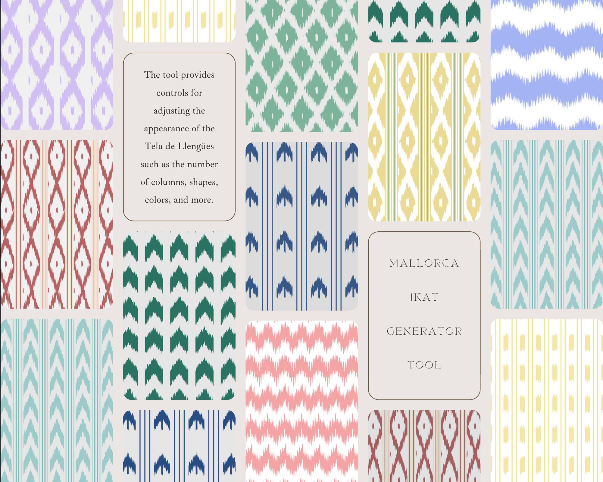
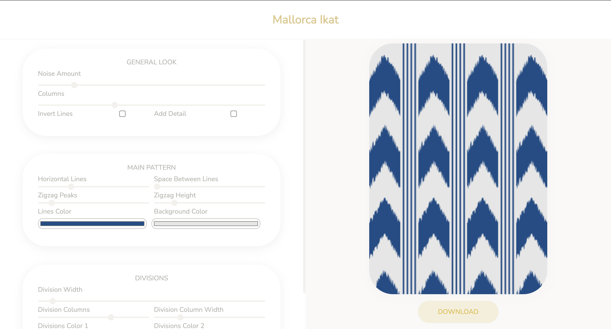

# Mallorca Ikat

This web tool allows you to create your own unique Tela de Llengües patterns by modifying various parameters such as the number of columns, shapes, colors, and more. Using the p5.js framework, the canvas is generated in real-time as you adjust the parameters, allowing you to see the changes and customize the pattern to your liking.

Tela de Llengües is a traditional ikat textile from the Balearic Island of Mallorca, known for its distinctive geometric patterns. By using this tool, you can explore and experiment with different variations of these patterns, and even use them for your own creative projects.

## Getting Started

To get started, simply open the ´index.html´ file in your web browser and begin adjusting the parameters using the sliders and buttons provided. You can also save your favorite patterns by clicking the "Download" button, which will generate a PNG image file that you can download and use as desired.

## Usage

The GUI provides a range of customizable parameters for generating the ikat pattern images. The parameters are grouped into the following sections:

#### General look
- Noise Amount: The amount of noise in the line's edges. 
- Columns: Controls the number of columns in the pattern.
- Invert Lines: Inverts the odd lines to have symmetric pairs.
- Add Detail: Adds extra details to the lines.

#### Main Pattern
- Horizontal Lines: Controls the number of horizontal lines in the pattern.
- Space Between Lines: Determines the spacing between each horizontal line.
- Zigzag Peaks: Controls the number of peaks in the zigzag lines.
- Zigzag Height: Determines the height of each zigzag peak.
- Lines Color: Sets the color of the pattern's lines.
- Background Color: Sets the color of the pattern's background.

#### Divisions
- Division Width: Determines the width of each division in the pattern.
- Division Columns: Controls the number of columns in the division grid.
- Division Column Width: Determines the width of each column in the division grid.
- Divisions Color 1: Sets the color of the primary division color.
- Divisions Color 2: Sets the color of the secondary division color.
